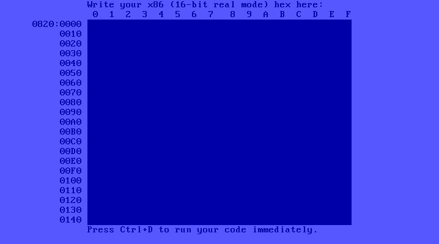

# bootstrap-os

A bootable x86 assembly editor that lets you run the code you type in.
Enough to bootstrap anything with no other tools.

Above is v0.4 (bootstrap-hex.asm), the latest release. Technically it is all you
need to create anything you want. For the full bootstrapping experience you'd
have to write your assembly on paper and hand-assemble it before typing it in
carefully.

Since you'd probably write a text editor and an assembler first thing, I think
it makes sense to just start there. I'm currently working on exactly that.

## Compatibility

This code is 16 bit real mode x86 assembly which Intel has kept available on all
x86 CPUs since the original 8086 processor from 1976. It also depends on the IBM
PC BIOS hardware interface standard from 1981 which modern computers still
implement.  Sadly Intel has partially ended this incredible nealy 40 year
backwards compatibility story by officially
[ending support for BIOS](https://www.bleepingcomputer.com/news/hardware/intel-plans-to-end-legacy-bios-support-by-2020/)
as of 2020, so now there are some machines on the market that only support UEFI
booting.

I believe the earliest machine this code would work on is the original 1981 IBM
PC with a 1984 EGA card expansion.

If it doesn't boot on your machine that supports BIOS, please let me know. I'd
love to find out why.

## Why?

Mainly I'm jealous of the people who grew up with computers that booted to a
basic editor and had computer magazines with code to type in.

I hope people will use this to learn more about the computers we use at a low
level and have fun running real assembly directly on the CPU with no other code
involved. Also I hope that some college classes might try teaching assembly with
real x86 using this instead of using a mips simulator (because I for one have
never seen a mips CPU).

I think modern software has gotten too far from the hardware. Also I thought it
would be fun to escape
[The 30 Million Line Problem](https://www.youtube.com/watch?v=kZRE7HIO3vk)
for a while.

## Booting it

### On Real Hardware

1. Get the binary from the releases or use the boot script (assemble it with
   `nasm`)
2. Write it to a usb drive: `dd if=bin/bootstrap-hex.bin of=/dev/sdb && sync`
   - Warning: make sure to change the output to the right path for your system.
     Use `fdisk -l` to list them.
   - You can backup the first couple sectors if you don't want to reformat the
     drive later with: `dd if=/dev/sdb of=sdb-10-sectors.bak bs=512 count=10`
3. Keep the USB plugged in and boot it on your computer in BIOS mode by pressing
   F2 or F11 during startup to get the system menu (also USB booting sometimes
   needs to be enabled in the setup menu)

### In QEMU

#### Linux / MacOS

1. Install `qemu` and `nasm` with your package manager of choice.
2. `./boot bootstrap-hex.asm`

#### Windows

 1. Install qemu: https://www.qemu.org/download/#windows
 2. Install nasm: https://www.nasm.us/pub/nasm/snapshots/latest/win64/
 3. Set the PATH variable:
    1. In the start menu, search for and open the environment variables editor 
    2. Choose either the user or system-wide Path variable and add both `C:\Program Files\NASM` & `C:\Program Files\qemu`
 4. `boot.bat bootstrap-hex.asm` (alternatively you can use the bash script in the git bash prompt)

## Reference Manuals

This project depends on the
[Intel Architecture Manual](https://software.intel.com/sites/default/files/managed/39/c5/325462-sdm-vol-1-2abcd-3abcd.pdf)
and the [1988 IBM BIOS Manual](http://bitsavers.trailing-edge.com/pdf/ibm/pc/ps2/15F0306_PS2_and_PC_BIOS_Interface_Technical_Reference_May88.pdf).
There's also the [1992 IBM VGA Card Manual](http://bitsavers.trailing-edge.com/pdf/ibm/pc/cards/IBM_VGA_XGA_Technical_Reference_Manual_May92.pdf)
which isn't really used in this project so far but would be useful for anyone
who wants to do graphics programming after BIOS booting.

Modern x86 computers still implement these standards and it makes me happy to
use the original documentation. Unfortunately to actually boot on modern
computers you have to comply with some manufacturer expectations added over the
years which I learned about on https://wiki.osdev.org/

### Script Instructions

`reference_manuals/get_docs` is script Bash users can run to download these
manuals and also optionally adds bookmarks to the IBM BIOS manual (which I
manually typed out) using `pdflatex` (you'll need to install that to add the
bookmarks).

Windows users could run it in WSL or copy the pdflatex commands out of the
script.

## Make Your Own Bootable Code

You can simply `%include` the `util/bootsect-header.asm` at the top of your
bootsector code and `util/bootsect-footer.asm` at the bottom. Feel free to
customize it and check out the comments for details. These two files contain all
the details to allow you to BIOS boot on real hardware.

Once you go over the single sector size nasm will give you an error. At that
point you'll have to put any additional code after `util/bootsect-footer.asm`
and write some code inside the bootsector to load any additional sectors from
disk (since the BIOS won't do it for you). Check out the bootsector code I'm
using for an example.
